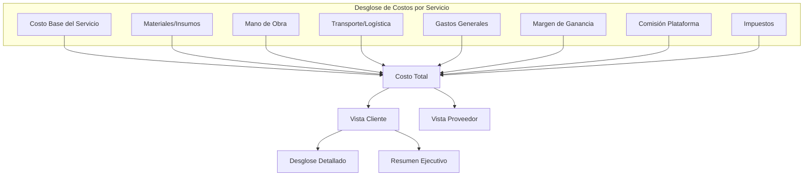
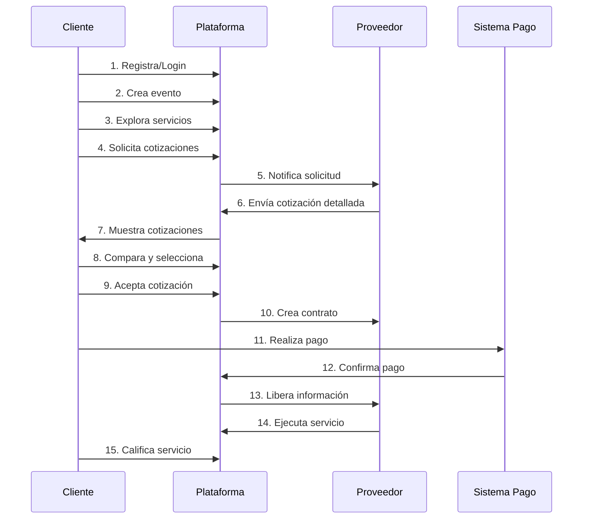
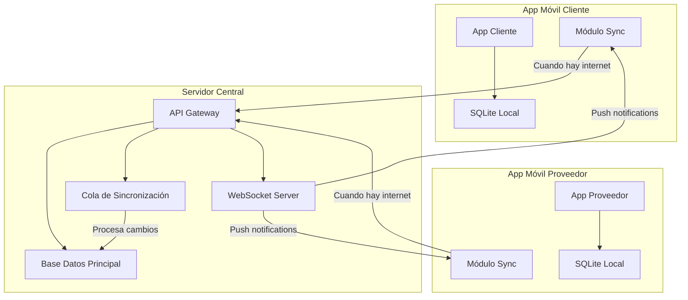
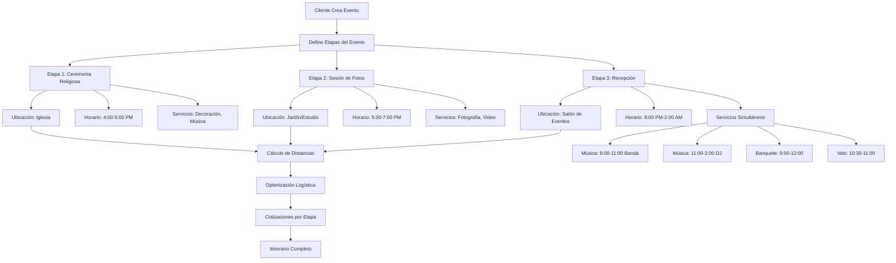

# ESPECIFICACIÓN TÉCNICA: PLATAFORMA DE GESTIÓN DE EVENTOS SOCIALES

## 1. VISIÓN DEL PRODUCTO

### Objetivo Principal
Crear una plataforma de tecnología de punta para la gestión integral de eventos sociales, basada en microservicios, con transparencia económica total y experiencia de usuario excepcional.

### Principios Fundamentales
- **Transparencia Económica**: Cada costo debe ser justificado y visible
- **Arquitectura de Microservicios**: Servicios independientes y escalables
- **Multi-plataforma**: Web, móvil (Android/iOS), escritorio
- **UI/UX Excepcional**: Interfaces intuitivas y atractivas
- **Solo Servicios Reales**: No simulaciones ni ejemplos

## 2. ARQUITECTURA GENERAL DEL SISTEMA

### 2.1 Microservicios Identificados

```mermaid
graph TB
    subgraph "Cliente Frontend"
        WEB[Web App - Clientes]
        MOBILE[Mobile App - iOS/Android]
        DESKTOP[Desktop App - Proveedores]
    end
    
    subgraph "API Gateway"
        GATEWAY[API Gateway + Load Balancer]
    end
    
    subgraph "Microservicios Core"
        AUTH[Servicio de Autenticación]
        USER[Gestión de Usuarios]
        EVENT[Gestión de Eventos]
        PROVIDER[Gestión de Proveedores]
        CATALOG[Catálogo de Servicios]
        QUOTE[Sistema de Cotizaciones]
        PAYMENT[Procesamiento de Pagos]
        NOTIFICATION[Notificaciones]
        MESSAGING[Mensajería]
        REVIEW[Reseñas y Calificaciones]
        GUEST[Gestión de Invitados]
        ITINERARY[Itinerarios y Horarios]
    end
    
    subgraph "Servicios de Apoyo"
        COST[Cálculo de Costos]
        ANALYTICS[Analytics y Reportes]
        FILE[Gestión de Archivos]
        LOCATION[Geolocalización y Mapas]
        LOGISTICS[Cálculo Logístico]
        GENEALOGY[Árbol Genealógico]
    end
    
    subgraph "Bases de Datos Aisladas"
        DB_AUTH[(DB Autenticación)]
        DB_USER[(DB Usuarios)]
        DB_EVENT[(DB Eventos)]
        DB_PROVIDER[(DB Proveedores)]
        DB_CATALOG[(DB Catálogo)]
        DB_FINANCIAL[(DB Financiero)]
        DB_GUEST[(DB Invitados)]
        DB_LOGISTICS[(DB Logística)]
    end
    
    WEB --> GATEWAY
    MOBILE --> GATEWAY
    DESKTOP --> GATEWAY
    
    GATEWAY --> AUTH
    GATEWAY --> USER
    GATEWAY --> EVENT
    GATEWAY --> PROVIDER
    GATEWAY --> CATALOG
    GATEWAY --> QUOTE
    GATEWAY --> PAYMENT
    GATEWAY --> NOTIFICATION
    GATEWAY --> MESSAGING
    GATEWAY --> REVIEW
    GATEWAY --> GUEST
    GATEWAY --> ITINERARY
    
    AUTH --> DB_AUTH
    USER --> DB_USER
    EVENT --> DB_EVENT
    PROVIDER --> DB_PROVIDER
    CATALOG --> DB_CATALOG
    QUOTE --> DB_FINANCIAL
    PAYMENT --> DB_FINANCIAL
    GUEST --> DB_GUEST
    ITINERARY --> DB_LOGISTICS
    LOCATION --> DB_LOGISTICS
    LOGISTICS --> DB_LOGISTICS
```

### 2.2 Stack Tecnológico Propuesto

**Backend Microservicios:**
- Node.js con TypeScript / .NET Core / Go
- Framework: Express.js / FastAPI / Gin
- Base de datos: PostgreSQL por microservicio
- Cache: Redis
- Message Queue: RabbitMQ / Apache Kafka

**Frontend:**
- Web: React.js / Vue.js con TypeScript
- Mobile: React Native / Flutter con SQLite local
- Desktop: Electron / Tauri
- Offline-First: Redux Persist / Zustand con sincronización

**Infraestructura:**
- Contenedores: Docker + Kubernetes
- API Gateway: Kong / Nginx
- Monitoreo: Prometheus + Grafana
- Logs: ELK Stack
- Sincronización: WebSockets + Queue de eventos
- Cache Local: SQLite + IndexedDB

## 3. ENTIDADES PRINCIPALES Y RELACIONES

### 3.1 Diagrama de Entidades

```mermaid
erDiagram
    USER {
        uuid id PK
        string email UK
        string password_hash
        string first_name
        string last_name
        string phone
        string profile_image
        enum user_type
        json social_auth
        timestamp created_at
        timestamp updated_at
        boolean is_active
    }
    
    CLIENT {
        uuid id PK
        uuid user_id FK
        string company_name
        json preferences
        json billing_info
    }
    
    PROVIDER {
        uuid id PK
        uuid user_id FK
        string business_name
        string business_license
        string tax_id
        json business_info
        decimal rating
        int total_reviews
        enum verification_status
        json portfolio
        json business_location
    }
    
    EVENT {
        uuid id PK
        uuid client_id FK
        string name
        text description
        datetime start_date
        datetime end_date
        int estimated_guests
        decimal budget_min
        decimal budget_max
        enum event_type
        enum status
        json requirements
        json main_celebrants
        timestamp created_at
    }
    
    EVENT_STAGE {
        uuid id PK
        uuid event_id FK
        string name
        text description
        enum stage_type
        int sequence_order
        boolean is_active
    }
    
    EVENT_LOCATION {
        uuid id PK
        uuid event_stage_id FK
        string name
        string address
        decimal latitude
        decimal longitude
        json maps_data
        datetime start_time
        datetime end_time
        json facilities
        json access_instructions
    }
    
    SERVICE_CATEGORY {
        uuid id PK
        string name
        string description
        string icon
        int sort_order
        boolean is_active
    }
    
    SERVICE {
        uuid id PK
        uuid provider_id FK
        uuid category_id FK
        string name
        text description
        json pricing_model
        json availability
        json portfolio_images
        json specifications
        boolean is_active
        boolean has_products
    }
    
    PRODUCT {
        uuid id PK
        uuid service_id FK
        uuid supplier_id FK
        string name
        text description
        decimal base_cost
        decimal markup_percentage
        json specifications
        string unit_measure
        int stock_quantity
        boolean is_active
    }
    
    SUPPLIER {
        uuid id PK
        uuid provider_id FK
        string name
        string contact_info
        json address
        json terms_conditions
        decimal rating
    }
    
    ITINERARY {
        uuid id PK
        uuid event_location_id FK
        uuid service_id FK
        string activity_name
        text description
        datetime start_time
        datetime end_time
        json participants
        json requirements
        enum status
        int priority_order
    }
    
    GUEST {
        uuid id PK
        uuid event_id FK
        string first_name
        string last_name
        string email
        string phone
        json address
        enum invitation_status
        enum attendance_status
        json dietary_restrictions
        json special_needs
        json social_profile
        enum honor_mention_type
        uuid assigned_table_id FK
        int social_proximity_score
        timestamp invited_at
        timestamp responded_at
    }
    
    EVENT_COLLABORATOR {
        uuid id PK
        uuid event_id FK
        uuid user_id FK
        enum role_type
        json permissions
        enum collaboration_status
        timestamp invited_at
        timestamp accepted_at
        boolean is_owner
    }
    
    TABLE_ASSIGNMENT {
        uuid id PK
        uuid event_location_id FK
        string table_name
        int capacity
        json table_position
        json assigned_guests
        decimal social_cohesion_score
    }
    
    QUOTE_TEMPLATE {
        uuid id PK
        uuid provider_id FK
        string template_name
        enum event_type
        int min_guests
        int max_guests
        json pre_configured_items
        json pricing_structure
        boolean is_active
        timestamp created_at
    }
    
    SYNC_QUEUE {
        uuid id PK
        uuid user_id FK
        string entity_type
        uuid entity_id
        enum action_type
        json data_payload
        enum sync_status
        timestamp created_at
        timestamp synced_at
        int retry_count
    }
    
    FAMILY_RELATIONSHIP {
        uuid id PK
        uuid guest_id FK
        uuid celebrant_id FK
        enum relationship_type
        string relationship_description
        int generation_level
    }
    
    QUOTE_REQUEST {
        uuid id PK
        uuid event_id FK
        uuid service_id FK
        uuid event_location_id FK
        json custom_requirements
        json selected_products
        enum status
        timestamp requested_at
    }
    
    QUOTE {
        uuid id PK
        uuid quote_request_id FK
        uuid provider_id FK
        decimal base_price
        json cost_breakdown
        json logistics_costs
        json terms_conditions
        datetime valid_until
        enum status
        timestamp created_at
    }
    
    CONTRACT {
        uuid id PK
        uuid quote_id FK
        uuid event_id FK
        json terms
        decimal total_amount
        json payment_schedule
        enum status
        timestamp signed_at
    }
    
    COST_ITEM {
        uuid id PK
        uuid quote_id FK
        uuid product_id FK
        string description
        decimal unit_cost
        int quantity
        decimal transport_cost
        decimal storage_cost
        decimal labor_cost
        decimal total_cost
        string justification
        enum cost_type
    }
    
    LOGISTICS_CALCULATION {
        uuid id PK
        uuid quote_id FK
        decimal distance_km
        decimal fuel_cost
        decimal time_cost
        decimal vehicle_cost
        json route_data
        timestamp calculated_at
    }
    
    REVIEW {
        uuid id PK
        uuid contract_id FK
        uuid client_id FK
        uuid provider_id FK
        int rating
        text comment
        json photos
        timestamp created_at
    }
    
    USER ||--o{ CLIENT : "puede ser"
    USER ||--o{ PROVIDER : "puede ser"
    CLIENT ||--o{ EVENT : "crea"
    
    EVENT ||--o{ EVENT_STAGE : "tiene"
    EVENT_STAGE ||--o{ EVENT_LOCATION : "se realiza en"
    
    EVENT ||--o{ GUEST : "invita"
    GUEST ||--o{ FAMILY_RELATIONSHIP : "tiene parentesco"
    
    EVENT_LOCATION ||--o{ ITINERARY : "programa"
    SERVICE ||--o{ ITINERARY : "participa en"
    
    PROVIDER ||--o{ SERVICE : "ofrece"
    PROVIDER ||--o{ SUPPLIER : "trabaja con"
    SERVICE ||--o{ PRODUCT : "incluye"
    SUPPLIER ||--o{ PRODUCT : "suministra"
    
    SERVICE_CATEGORY ||--o{ SERVICE : "categoriza"
    
    EVENT ||--o{ QUOTE_REQUEST : "genera"
    SERVICE ||--o{ QUOTE_REQUEST : "recibe"
    EVENT_LOCATION ||--o{ QUOTE_REQUEST : "especifica lugar"
    
    QUOTE_REQUEST ||--o{ QUOTE : "genera"
    QUOTE ||--o{ CONTRACT : "se convierte en"
    
    QUOTE ||--o{ COST_ITEM : "detalla"
    PRODUCT ||--o{ COST_ITEM : "incluido en"
    
    QUOTE ||--o{ LOGISTICS_CALCULATION : "calcula"
    
    CONTRACT ||--o{ REVIEW : "puede tener"
    
    EVENT ||--o{ EVENT_COLLABORATOR : "tiene colaboradores"
    USER ||--o{ EVENT_COLLABORATOR : "colabora en"
    
    EVENT_LOCATION ||--o{ TABLE_ASSIGNMENT : "organiza mesas"
    GUEST ||--o{ TABLE_ASSIGNMENT : "asignado a"
    
    PROVIDER ||--o{ QUOTE_TEMPLATE : "crea plantillas"
    QUOTE_TEMPLATE ||--o{ QUOTE : "genera desde"
    
    USER ||--o{ SYNC_QUEUE : "genera cambios offline"
```

## 4. MODELO ECONÓMICO Y SISTEMA DE COSTOS

### 4.1 Estructura de Costos Transparente

### 4.2 Modelo de Ingresos de la Plataforma

- **Comisión por Transacción**: 3-8% sobre el valor del contrato
- **Suscripciones Premium**: Funcionalidades avanzadas para proveedores
- **Servicios Adicionales**: Verificación de proveedores, seguros, etc.
- **Publicidad Dirigida**: Promoción de servicios específicos

## 5. INTERFACES DE USUARIO POR TIPO DE CLIENTE

### 5.1 App Móvil Cliente (iOS/Android - Offline First)
- **Modo Offline Completo**: Todas las funciones disponibles sin internet
- **Dashboard Principal**: Eventos activos, pasados y próximos
- **Creador de Eventos Multi-etapa**: 
  - Definición de etapas (ceremonia, recepción, etc.)
  - Asignación de ubicaciones con mapas integrados
  - Configuración de horarios por ubicación
- **Gestión Avanzada de Invitados**:
  - Árbol genealógico interactivo
  - Invitaciones digitales personalizadas
  - Asignación inteligente de mesas por proximidad social
  - Menciones de honor (padrinos, familia cercana)
  - Control de asistencia y restricciones dietéticas
- **Sistema de Colaboradores**:
  - Invitar organizadores, familiares, proveedores
  - Roles personalizables con permisos específicos
  - Colaboración en tiempo real
- **Itinerario Completo**:
  - Vista cronológica del evento
  - Servicios por ubicación y horario
  - Actividades simultáneas (banda + banquete)
- **Explorador de Servicios** con filtros geográficos
- **Comparador de Cotizaciones** con plantillas pre-estructuradas
- **Sistema de Pagos** y facturación detallada
- **Sincronización Automática** cuando recupera conexión

### 5.2 App Móvil Proveedor (iOS/Android - Offline First)
- **Modo Offline Completo**: Cotizaciones y gestión sin internet
- **Panel de Gestión de Servicios** y productos
- **Rol Dual**: Proveedor de servicios + Organizador de eventos
- **Plantillas de Cotización Pre-estructuradas**:
  - Por tipo de evento (boda, XV años, cumpleaños)
  - Por cantidad de invitados (50, 100, 200+)
  - Paquetes completos con logística incluida
- **Gestión de Suppliers**: Proveedores y costos
- **Calculadora de Costos Inteligente**:
  - Cálculo automático de distancias
  - Costos de transporte y logística
  - Markup por almacenamiento y procesamiento
- **Modo Organizador de Eventos**:
  - Crear eventos para clientes
  - Gestionar todos los aspectos técnicos
  - Invitar al cliente como colaborador/auditor
- **Gestión de Cotizaciones** multi-ubicación
- **Calendario de Disponibilidad** por servicio
- **Análisis Financiero** con métricas de rentabilidad
- **Sincronización Inteligente** con cola de prioridades

### 5.3 Plataforma Web Escritorio (Todos los Roles)
- **Sistema de Roles Flexibles**:
  - Cliente → puede ser Organizador
  - Proveedor → puede ser Organizador de eventos
  - Organizador → puede gestionar múltiples eventos
  - Colaborador → permisos específicos por evento
- **Administración de Plataforma**:
  - Monitoreo de transacciones
  - Gestión de usuarios y proveedores
  - Análisis de métricas del negocio
  - Moderación de contenido
  - Configuración de comisiones
- **Algoritmos Inteligentes**:
  - Asignación óptima de mesas
  - Recomendaciones de servicios
  - Optimización de rutas logísticas

## 6. SISTEMA DE AUTENTICACIÓN Y PERMISOS

### 6.1 Autenticación
- Login social con Google OAuth 2.0
- Registro tradicional con email/password
- Autenticación de dos factores (2FA)
- JWT para manejo de sesiones
- Refresh tokens para seguridad

### 6.2 Autorización (RBAC)
- **Cliente**: Crear eventos, ver cotizaciones, hacer pagos
- **Proveedor**: Gestionar servicios, enviar cotizaciones, ver contratos
- **Admin**: Acceso completo al sistema
- **Moderador**: Gestión de contenido y disputas

## 7. FLUJO PRINCIPAL DE LA APLICACIÓN

## 8. REQUISITOS NO FUNCIONALES

### 8.1 Rendimiento
- Tiempo de respuesta < 200ms para consultas simples
- Tiempo de respuesta < 1s para consultas complejas
- Disponibilidad 99.9%
- Soporte para 10,000 usuarios concurrentes

### 8.2 Seguridad
- Encriptación HTTPS/TLS 1.3
- Datos sensibles encriptados en BD
- Auditoría completa de transacciones
- Cumplimiento PCI DSS para pagos
- Respaldo de datos cada 24 horas

### 8.3 Escalabilidad
- Arquitectura cloud-native
- Auto-scaling horizontal
- CDN para contenido estático
- Cache distribuido
- Base de datos sharding

## 9. FUNCIONALIDADES AVANZADAS

### 9.1 Sistema de Eventos Multi-etapa
- Eventos con múltiples ubicaciones (iglesia, salón, casa)
- Itinerarios detallados por ubicación
- Integración con Google Maps para rutas
- Horarios superpuestos y actividades simultáneas

### 9.2 Aplicaciones Móviles Offline-First
- **Funcionalidad completa sin internet**
- **Base de datos local**: SQLite en móvil
- **Sincronización inteligente**: 
  - Cola de cambios pendientes
  - Resolución automática de conflictos
  - Prioridad por tipo de datos
- **Cache local**: Imágenes, mapas, cotizaciones
- **Notificaciones push** cuando se recupera conexión

### 9.3 Sistema de Colaboradores Multi-Rol
- **Roles flexibles**:
  - Cliente → Organizador de eventos
  - Proveedor → Organizador profesional
  - Colaborador → Familiar/Amigo con permisos
  - Auditor → Solo lectura y comentarios
- **Permisos granulares** por sección del evento
- **Colaboración en tiempo real** con conflictos resueltos
- **Historial de cambios** por colaborador

### 9.4 Asignación Inteligente de Mesas
- **Algoritmo de proximidad social**:
  - Relación genealógica (familia cercana junta)
  - Afinidad sentimental (parejas, amigos íntimos)
  - Edad y intereses comunes
  - Restricciones dietéticas compatibles
- **Menciones de honor**: Padrinos, familia especial
- **Optimización automática** con machine learning
- **Vista previa 3D** del salón con disposición

### 9.5 Cotizaciones Pre-estructuradas
- **Plantillas por tipo de evento**:
  - Boda (50-500 invitados)
  - XV Años (30-300 invitados)
  - Cumpleaños corporativo (20-200 invitados)
- **Paquetes all-inclusive** con logística completa
- **Escalamiento automático** según cantidad de invitados
- **Personalización rápida** desde plantilla base

### 9.6 Gestión Avanzada de Invitados
- Árbol genealógico con múltiples celebrantes
- Invitaciones digitales personalizadas
- Información de mesa de regalos
- Galería compartida de fotos/videos
- Programa de platillos y menús

### 9.7 Sistema de Productos y Proveedores Anidados
- Proveedores pueden tener sub-proveedores
- Productos con costos base + markup
- Cálculo automático de costos logísticos
- Gestión de inventario por producto

### 9.8 Cálculos Logísticos Inteligentes
- Distancias automáticas entre proveedor y evento
- Costos de transporte por km
- Tiempo de traslado y costos de combustible
- Optimización de rutas para múltiples entregas

## PRÓXIMOS PASOS

1. ✅ Validar arquitectura propuesta
2. ✅ Definir modelo de datos extendido
3. 🔄 Crear MVP con funcionalidades core
4. ⏳ Definir APIs entre microservicios
5. ⏳ Configurar ambiente de desarrollo
6. ⏳ Implementar autenticación y gestión de usuarios

---
### 9.9 Diagrama de Arquitectura Offline-First

### 9.10 Diagrama de Flujo de Evento Multi-etapa

---
**Fecha de creación**: 29 de Julio, 2025
**Estado**: Especificación extendida con funcionalidades avanzadas
**Última actualización**: Apps offline-first, colaboradores multi-rol, asignación inteligente
**Próxima revisión**: Definición de MVP y APIs