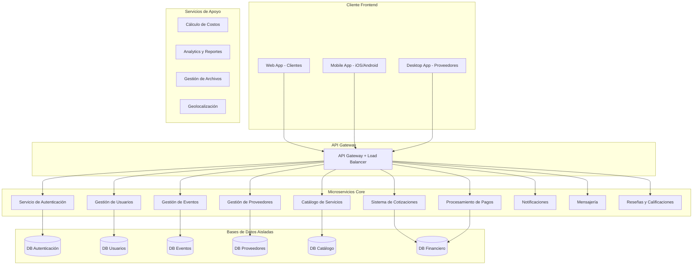
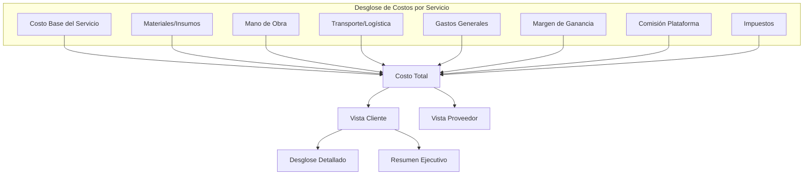
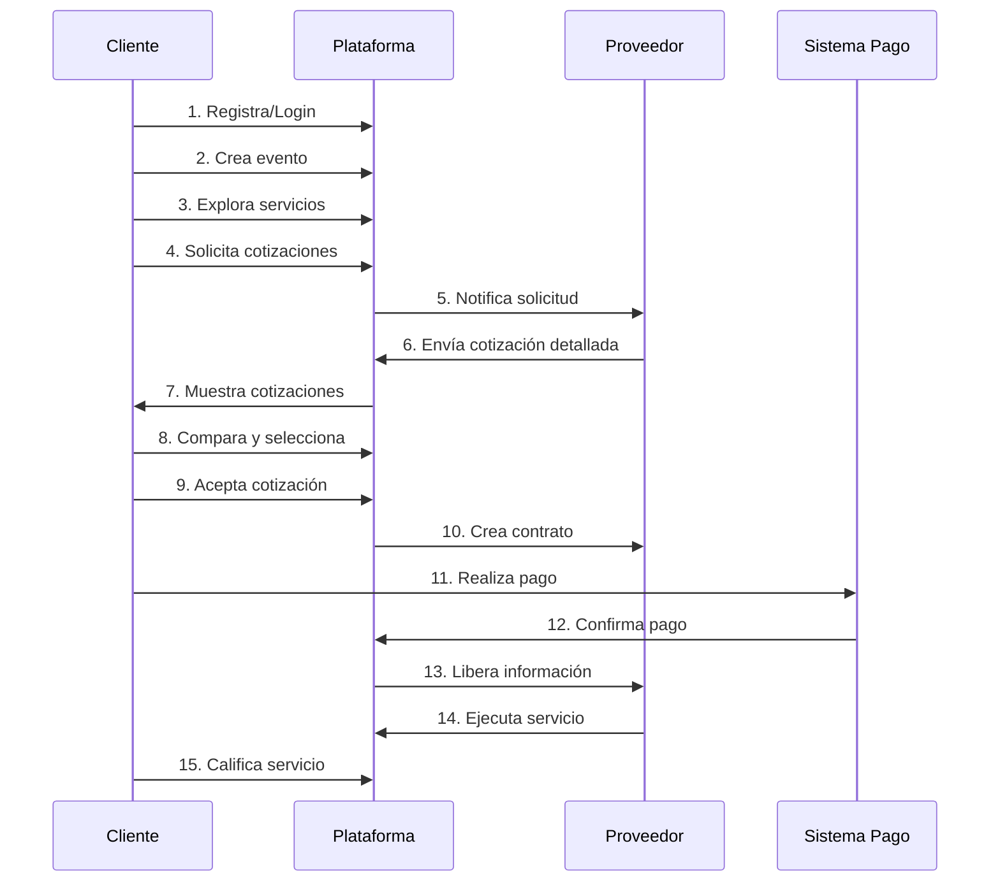

# ESPECIFICACIÓN TÉCNICA: PLATAFORMA DE GESTIÓN DE EVENTOS SOCIALES

## 1. VISIÓN DEL PRODUCTO

### Objetivo Principal
Crear una plataforma de tecnología de punta para la gestión integral de eventos sociales, basada en microservicios, con transparencia económica total y experiencia de usuario excepcional.

### Principios Fundamentales
- **Transparencia Económica**: Cada costo debe ser justificado y visible
- **Arquitectura de Microservicios**: Servicios independientes y escalables
- **Multi-plataforma**: Web, móvil (Android/iOS), escritorio
- **UI/UX Excepcional**: Interfaces intuitivas y atractivas
- **Solo Servicios Reales**: No simulaciones ni ejemplos

## 2. ARQUITECTURA GENERAL DEL SISTEMA

### 2.1 Microservicios Identificados

### 2.2 Stack Tecnológico Propuesto

**Backend Microservicios:**
- Node.js con TypeScript / .NET Core / Go
- Framework: Express.js / FastAPI / Gin
- Base de datos: PostgreSQL por microservicio
- Cache: Redis
- Message Queue: RabbitMQ / Apache Kafka

**Frontend:**
- Web: React.js / Vue.js con TypeScript
- Mobile: React Native / Flutter
- Desktop: Electron / Tauri

**Infraestructura:**
- Contenedores: Docker + Kubernetes
- API Gateway: Kong / Nginx
- Monitoreo: Prometheus + Grafana
- Logs: ELK Stack

## 3. ENTIDADES PRINCIPALES Y RELACIONES

### 3.1 Diagrama de Entidades

```mermaid
erDiagram
    USER {
        uuid id PK
        string email UK
        string password_hash
        string first_name
        string last_name
        string phone
        string profile_image
        enum user_type
        json social_auth
        timestamp created_at
        timestamp updated_at
        boolean is_active
    }
    
    CLIENT {
        uuid id PK
        uuid user_id FK
        string company_name
        json preferences
        json billing_info
    }
    
    PROVIDER {
        uuid id PK
        uuid user_id FK
        string business_name
        string business_license
        string tax_id
        json business_info
        decimal rating
        int total_reviews
        enum verification_status
        json portfolio
    }
    
    EVENT {
        uuid id PK
        uuid client_id FK
        string name
        text description
        datetime event_date
        string location
        json location_coords
        int estimated_guests
        decimal budget_min
        decimal budget_max
        enum event_type
        enum status
        json requirements
        timestamp created_at
    }
    
    SERVICE_CATEGORY {
        uuid id PK
        string name
        string description
        string icon
        int sort_order
        boolean is_active
    }
    
    SERVICE {
        uuid id PK
        uuid provider_id FK
        uuid category_id FK
        string name
        text description
        json pricing_model
        json availability
        json portfolio_images
        json specifications
        boolean is_active
    }
    
    QUOTE_REQUEST {
        uuid id PK
        uuid event_id FK
        uuid service_id FK
        json custom_requirements
        enum status
        timestamp requested_at
    }
    
    QUOTE {
        uuid id PK
        uuid quote_request_id FK
        uuid provider_id FK
        decimal base_price
        json cost_breakdown
        json terms_conditions
        datetime valid_until
        enum status
        timestamp created_at
    }
    
    CONTRACT {
        uuid id PK
        uuid quote_id FK
        uuid event_id FK
        json terms
        decimal total_amount
        json payment_schedule
        enum status
        timestamp signed_at
    }
    
    COST_ITEM {
        uuid id PK
        uuid quote_id FK
        string description
        decimal unit_cost
        int quantity
        decimal total_cost
        string justification
        enum cost_type
    }
    
    REVIEW {
        uuid id PK
        uuid contract_id FK
        uuid client_id FK
        uuid provider_id FK
        int rating
        text comment
        json photos
        timestamp created_at
    }
    
    USER ||--o{ CLIENT : "puede ser"
    USER ||--o{ PROVIDER : "puede ser"
    CLIENT ||--o{ EVENT : "crea"
    EVENT ||--o{ QUOTE_REQUEST : "genera"
    SERVICE ||--o{ QUOTE_REQUEST : "recibe"
    PROVIDER ||--o{ SERVICE : "ofrece"
    SERVICE_CATEGORY ||--o{ SERVICE : "categoriza"
    QUOTE_REQUEST ||--o{ QUOTE : "genera"
    QUOTE ||--o{ CONTRACT : "se convierte en"
    QUOTE ||--o{ COST_ITEM : "detalla"
    CONTRACT ||--o{ REVIEW : "puede tener"
```

## 4. MODELO ECONÓMICO Y SISTEMA DE COSTOS

### 4.1 Estructura de Costos Transparente

### 4.2 Modelo de Ingresos de la Plataforma

- **Comisión por Transacción**: 3-8% sobre el valor del contrato
- **Suscripciones Premium**: Funcionalidades avanzadas para proveedores
- **Servicios Adicionales**: Verificación de proveedores, seguros, etc.
- **Publicidad Dirigida**: Promoción de servicios específicos

## 5. INTERFACES DE USUARIO POR TIPO DE CLIENTE

### 5.1 Cliente Final (Web/Mobile)
- Dashboard de eventos activos y pasados
- Creador de eventos paso a paso
- Explorador de servicios con filtros avanzados
- Comparador de cotizaciones
- Chat integrado con proveedores
- Sistema de pagos y facturación
- Galería de eventos completados

### 5.2 Proveedor de Servicios (Desktop/Web)
- Panel de gestión de servicios
- Calculadora de costos inteligente
- Gestión de cotizaciones y contratos
- Calendario de disponibilidad
- Análisis de desempeño y ganancias
- Gestión de portafolio
- Sistema de mensajería con clientes

### 5.3 Administrador de Plataforma
- Monitoreo de transacciones
- Gestión de usuarios y proveedores
- Análisis de métricas del negocio
- Moderación de contenido
- Configuración de comisiones

## 6. SISTEMA DE AUTENTICACIÓN Y PERMISOS

### 6.1 Autenticación
- Login social con Google OAuth 2.0
- Registro tradicional con email/password
- Autenticación de dos factores (2FA)
- JWT para manejo de sesiones
- Refresh tokens para seguridad

### 6.2 Autorización (RBAC)
- **Cliente**: Crear eventos, ver cotizaciones, hacer pagos
- **Proveedor**: Gestionar servicios, enviar cotizaciones, ver contratos
- **Admin**: Acceso completo al sistema
- **Moderador**: Gestión de contenido y disputas

## 7. FLUJO PRINCIPAL DE LA APLICACIÓN

## 8. REQUISITOS NO FUNCIONALES

### 8.1 Rendimiento
- Tiempo de respuesta < 200ms para consultas simples
- Tiempo de respuesta < 1s para consultas complejas
- Disponibilidad 99.9%
- Soporte para 10,000 usuarios concurrentes

### 8.2 Seguridad
- Encriptación HTTPS/TLS 1.3
- Datos sensibles encriptados en BD
- Auditoría completa de transacciones
- Cumplimiento PCI DSS para pagos
- Respaldo de datos cada 24 horas

### 8.3 Escalabilidad
- Arquitectura cloud-native
- Auto-scaling horizontal
- CDN para contenido estático
- Cache distribuido
- Base de datos sharding

## PRÓXIMOS PASOS

1. ✅ Validar arquitectura propuesta
2. ✅ Definir MVP (Minimum Viable Product)
3. ✅ Crear wireframes de interfaces
4. ✅ Definir APIs entre microservicios
5. ✅ Configurar ambiente de desarrollo
6. ✅ Implementar primer microservicio (Auth)

---
**Fecha de creación**: 29 de Julio, 2025
**Estado**: Documento base para desarrollo
**Próxima revisión**: Validación con stakeholders