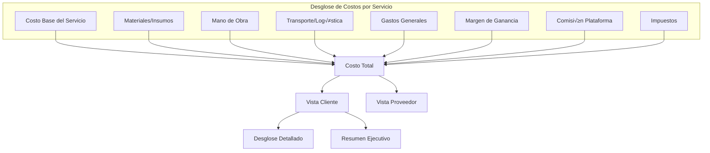
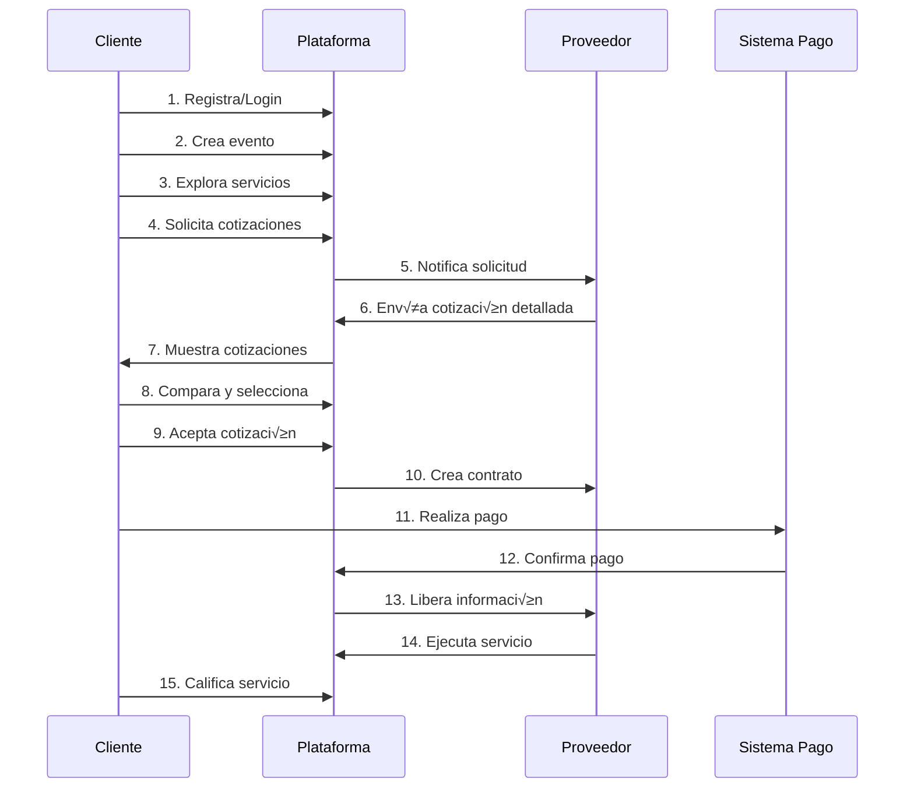
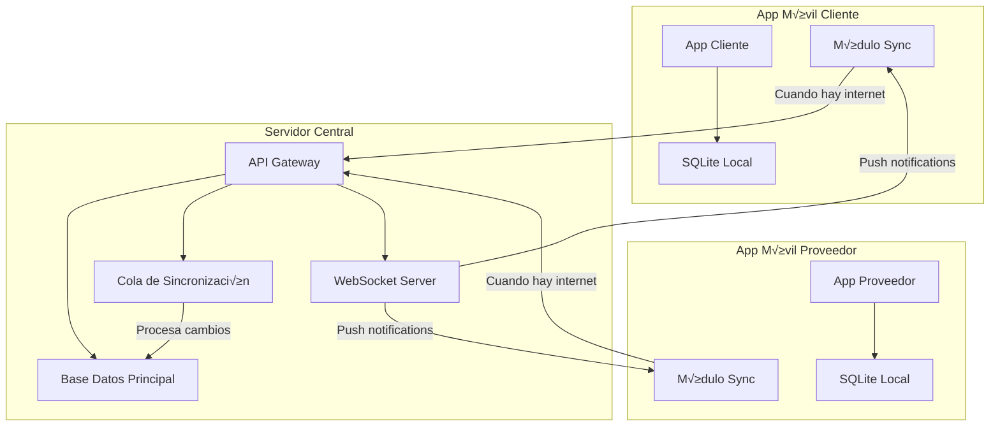
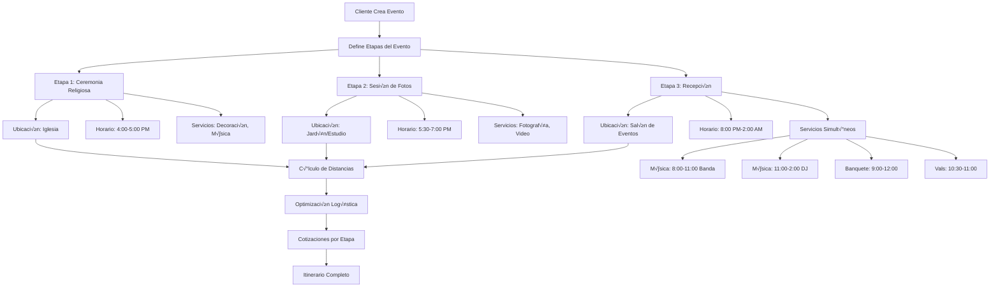

# ESPECIFICACIÓN TÉCNICA: PLATAFORMA DE GESTIÓN DE EVENTOS SOCIALES

## 1. VISIÓN DEL PRODUCTO

### Objetivo Principal
Crear una plataforma de tecnología de punta para la gestión integral de eventos sociales, basada en microservicios, con transparencia económica total y experiencia de usuario excepcional.

### Principios Fundamentales
- **Transparencia Económica**: Cada costo debe ser justificado y visible
- **Arquitectura de Microservicios**: Servicios independientes y escalables
- **Multi-plataforma**: Web, móvil (Android/iOS), escritorio
- **UI/UX Excepcional**: Interfaces intuitivas y atractivas
- **Solo Servicios Reales**: No simulaciones ni ejemplos

## 2. ARQUITECTURA GENERAL DEL SISTEMA

### 2.1 Microservicios Identificados

```mermaid
graph TB
    subgraph "Cliente Frontend"
        WEB[Web App - Clientes]
        MOBILE[Mobile App - iOS/Android]
        DESKTOP[Desktop App - Proveedores]
    end
    
    subgraph "API Gateway"
        GATEWAY[API Gateway + Load Balancer]
    end
    
    subgraph "Microservicios Core"
        AUTH[Servicio de Autenticación]
        USER[Gestión de Usuarios]
        EVENT[Gestión de Eventos]
        PROVIDER[Gestión de Proveedores]
        CATALOG[Cat√°logo de Servicios]
        QUOTE[Sistema de Cotizaciones]
        PAYMENT[Procesamiento de Pagos]
        NOTIFICATION[Notificaciones]
        MESSAGING[Mensajería]
        REVIEW[Reseñas y Calificaciones]
        GUEST[Gestión de Invitados]
        ITINERARY[Itinerarios y Horarios]
    end
    
    subgraph "Servicios de Apoyo"
        COST[C√°lculo de Costos]
        ANALYTICS[Analytics y Reportes]
        FILE[Gestión de Archivos]
        LOCATION[Geolocalización y Mapas]
        LOGISTICS[Cálculo Logístico]
        GENEALOGY[Árbol Genealógico]
    end
    
    subgraph "Bases de Datos Aisladas"
        DB_AUTH[(DB Autenticación)]
        DB_USER[(DB Usuarios)]
        DB_EVENT[(DB Eventos)]
        DB_PROVIDER[(DB Proveedores)]
        DB_CATALOG[(DB Cat√°logo)]
        DB_FINANCIAL[(DB Financiero)]
        DB_GUEST[(DB Invitados)]
        DB_LOGISTICS[(DB Logística)]
    end
    
    WEB --> GATEWAY
    MOBILE --> GATEWAY
    DESKTOP --> GATEWAY
    
    GATEWAY --> AUTH
    GATEWAY --> USER
    GATEWAY --> EVENT
    GATEWAY --> PROVIDER
    GATEWAY --> CATALOG
    GATEWAY --> QUOTE
    GATEWAY --> PAYMENT
    GATEWAY --> NOTIFICATION
    GATEWAY --> MESSAGING
    GATEWAY --> REVIEW
    GATEWAY --> GUEST
    GATEWAY --> ITINERARY
    
    AUTH --> DB_AUTH
    USER --> DB_USER
    EVENT --> DB_EVENT
    PROVIDER --> DB_PROVIDER
    CATALOG --> DB_CATALOG
    QUOTE --> DB_FINANCIAL
    PAYMENT --> DB_FINANCIAL
    GUEST --> DB_GUEST
    ITINERARY --> DB_LOGISTICS
    LOCATION --> DB_LOGISTICS
    LOGISTICS --> DB_LOGISTICS
```

### 2.2 Stack Tecnológico Propuesto

**Backend Microservicios:**
- Node.js con TypeScript / .NET Core / Go
- Framework: Express.js / FastAPI / Gin
- Base de datos: PostgreSQL por microservicio
- Cache: Redis
- Message Queue: RabbitMQ / Apache Kafka

**Frontend:**
- Web: React.js / Vue.js con TypeScript
- Mobile: React Native / Flutter con SQLite local
- Desktop: Electron / Tauri
- Offline-First: Redux Persist / Zustand con sincronización

**Infraestructura:**
- Contenedores: Docker + Kubernetes
- API Gateway: Kong / Nginx
- Monitoreo: Prometheus + Grafana
- Logs: ELK Stack
- Sincronización: WebSockets + Queue de eventos
- Cache Local: SQLite + IndexedDB

## 3. ENTIDADES PRINCIPALES Y RELACIONES

### 3.1 Diagrama de Entidades

```mermaid
erDiagram
    USUARIO {
        uuid id PK
        string correo_electronico UK
        string hash_contrasena
        string primer_nombre
        string apellido_paterno
        string telefono
        string imagen_perfil
        enum tipo_usuario
        json autenticacion_social
        timestamp fecha_creacion
        timestamp fecha_actualizacion
        boolean esta_activo
    }
    
    CLIENTE {
        uuid id PK
        uuid usuario_id FK
        string nombre_empresa
        json preferencias
        json informacion_facturacion
    }
    
    PROVEEDOR {
        uuid id PK
        uuid usuario_id FK
        string nombre_negocio
        string licencia_comercial
        string numero_fiscal
        json informacion_negocio
        decimal calificacion
        int total_resenas
        enum estatus_verificacion
        json portafolio
        json ubicacion_negocio
        boolean es_multiservicios
        json tipos_costo_persona
    }
    
    EVENTO {
        uuid id PK
        uuid cliente_id FK
        string nombre
        text descripcion
        datetime fecha_inicio
        datetime fecha_fin
        int invitados_estimados
        decimal presupuesto_minimo
        decimal presupuesto_maximo
        enum tipo_evento
        enum estatus
        json requerimientos
        json festejados_principales
        json configuracion_privacidad
        timestamp fecha_creacion
    }
    
    ETAPA_EVENTO {
        uuid id PK
        uuid evento_id FK
        string nombre
        text descripcion
        enum tipo_etapa
        int orden_secuencia
        boolean esta_activa
    }
    
    UBICACION_EVENTO {
        uuid id PK
        uuid etapa_evento_id FK
        string nombre
        string direccion
        decimal latitud
        decimal longitud
        json datos_mapa
        datetime hora_inicio
        datetime hora_fin
        json instalaciones
        json instrucciones_acceso
        json diseno_salon
        int capacidad_maxima
    }
    
    CATEGORIA_SERVICIO {
        uuid id PK
        string nombre
        string descripcion
        string icono
        int orden_clasificacion
        boolean esta_activa
    }
    
    SERVICIO {
        uuid id PK
        uuid proveedor_id FK
        uuid categoria_id FK
        uuid cliente_creador_id FK
        string nombre
        text descripcion
        json modelo_precios
        json disponibilidad
        json imagenes_portafolio
        json especificaciones
        boolean esta_activo
        boolean tiene_productos
        boolean es_personalizado
        enum tipo_costo
    }
    
    PRODUCTO {
        uuid id PK
        uuid servicio_id FK
        uuid proveedor_suministro_id FK
        string nombre
        text descripcion
        decimal costo_base
        decimal porcentaje_ganancia
        json especificaciones
        string unidad_medida
        int cantidad_inventario
        boolean esta_activo
        json escala_costo_persona
    }
    
    PROVEEDOR_SUMINISTRO {
        uuid id PK
        uuid proveedor_id FK
        string nombre
        string informacion_contacto
        json direccion
        json terminos_condiciones
        decimal calificacion
    }
    
    ITINERARIO {
        uuid id PK
        uuid ubicacion_evento_id FK
        uuid servicio_id FK
        string nombre_actividad
        text descripcion
        datetime hora_inicio
        datetime hora_fin
        json participantes
        json requerimientos
        enum estatus
        int orden_prioridad
    }
    
    INVITADO {
        uuid id PK
        uuid evento_id FK
        string primer_nombre
        string apellido_paterno
        string correo_electronico
        string telefono
        json direccion
        enum estatus_invitacion
        enum estatus_asistencia
        json restricciones_dieteticas
        json necesidades_especiales
        json perfil_social
        enum tipo_mencion_honor
        uuid mesa_asignada_id FK
        int puntuacion_proximidad_social
        timestamp fecha_invitacion
        timestamp fecha_respuesta
    }
    
    COLABORADOR_EVENTO {
        uuid id PK
        uuid evento_id FK
        uuid usuario_id FK
        enum tipo_rol
        json permisos
        enum estatus_colaboracion
        timestamp fecha_invitacion
        timestamp fecha_aceptacion
        boolean es_propietario
    }
    
    ASIGNACION_MESA {
        uuid id PK
        uuid ubicacion_evento_id FK
        string nombre_mesa
        int capacidad
        json posicion_mesa
        json invitados_asignados
        decimal puntuacion_cohesion_social
        enum tipo_mesa
        json configuracion_visual
    }
    
    PLANTILLA_COTIZACION {
        uuid id PK
        uuid proveedor_id FK
        string nombre_plantilla
        enum tipo_evento
        int minimo_invitados
        int maximo_invitados
        json conceptos_preconfigurados
        json estructura_precios
        boolean esta_activa
        timestamp fecha_creacion
    }
    
    COLA_SINCRONIZACION {
        uuid id PK
        uuid usuario_id FK
        string tipo_entidad
        uuid entidad_id
        enum tipo_accion
        json datos_carga
        enum estatus_sincronizacion
        timestamp fecha_creacion
        timestamp fecha_sincronizacion
        int contador_reintentos
    }
    
    PARENTESCO_FAMILIAR {
        uuid id PK
        uuid invitado_id FK
        uuid festejado_id FK
        enum tipo_parentesco
        string descripcion_parentesco
        int nivel_generacional
    }
    
    INVITACION_DIGITAL {
        uuid id PK
        uuid evento_id FK
        string titulo
        text mensaje_personalizado
        json diseno_plantilla
        json informacion_publica
        json informacion_privada
        string enlace_web
        string ruta_pdf
        json configuracion_privacidad
        timestamp fecha_creacion
    }
    
    HISTORIAL_PAGOS {
        uuid id PK
        uuid contrato_id FK
        decimal monto
        enum metodo_pago
        enum estatus_pago
        string referencia_transaccion
        timestamp fecha_pago
        json comprobante_pago
    }
    
    EVIDENCIA_ETAPA {
        uuid id PK
        uuid contrato_id FK
        uuid etapa_evento_id FK
        string titulo
        text descripcion
        json archivos_multimedia
        enum tipo_evidencia
        timestamp fecha_subida
        uuid usuario_subida_id FK
    }
    
    FICHA_TECNICA_PROVEEDOR {
        uuid id PK
        uuid proveedor_id FK
        json experiencia_anos
        json certificaciones
        json trabajos_anteriores
        json galeria_proyectos
        json especialidades
        json areas_cobertura
        timestamp fecha_actualizacion
    }
    
    REPORTE_PERSONALIZADO {
        uuid id PK
        uuid evento_id FK
        uuid usuario_generador_id FK
        string nombre_reporte
        json configuracion_datos
        json filtros_aplicados
        enum formato_exportacion
        timestamp fecha_generacion
        string ruta_archivo
    }
    
    SOLICITUD_COTIZACION {
        uuid id PK
        uuid evento_id FK
        uuid servicio_id FK
        uuid ubicacion_evento_id FK
        json requerimientos_personalizados
        json productos_seleccionados
        enum estatus
        timestamp fecha_solicitud
    }
    
    COTIZACION {
        uuid id PK
        uuid solicitud_cotizacion_id FK
        uuid proveedor_id FK
        decimal precio_base
        json desglose_costos
        json costos_logisticos
        json terminos_condiciones
        datetime valida_hasta
        enum estatus
        timestamp fecha_creacion
    }
    
    CONTRATO {
        uuid id PK
        uuid cotizacion_id FK
        uuid evento_id FK
        json terminos
        decimal monto_total
        json cronograma_pagos
        enum estatus
        timestamp fecha_firma
        json evidencias_cumplimiento
    }
    
    CONCEPTO_COSTO {
        uuid id PK
        uuid cotizacion_id FK
        uuid producto_id FK
        string descripcion
        decimal costo_unitario
        int cantidad
        decimal costo_transporte
        decimal costo_almacenamiento
        decimal costo_mano_obra
        decimal costo_total
        string justificacion
        enum tipo_costo
    }
    
    CALCULO_LOGISTICO {
        uuid id PK
        uuid cotizacion_id FK
        decimal distancia_km
        decimal costo_combustible
        decimal costo_tiempo
        decimal costo_vehiculo
        json datos_ruta
        timestamp fecha_calculo
    }
    
    RESENA {
        uuid id PK
        uuid contrato_id FK
        uuid cliente_id FK
        uuid proveedor_id FK
        int calificacion
        text comentario
        json fotos
        timestamp fecha_creacion
    }
    
    USUARIO ||--o{ CLIENTE : "puede ser"
    USUARIO ||--o{ PROVEEDOR : "puede ser"
    CLIENTE ||--o{ EVENTO : "crea"
    
    EVENTO ||--o{ ETAPA_EVENTO : "tiene"
    ETAPA_EVENTO ||--o{ UBICACION_EVENTO : "se realiza en"
    
    EVENTO ||--o{ INVITADO : "invita"
    INVITADO ||--o{ PARENTESCO_FAMILIAR : "tiene parentesco"
    
    UBICACION_EVENTO ||--o{ ITINERARIO : "programa"
    SERVICIO ||--o{ ITINERARIO : "participa en"
    
    PROVEEDOR ||--o{ SERVICIO : "ofrece"
    CLIENTE ||--o{ SERVICIO : "personaliza"
    PROVEEDOR ||--o{ PROVEEDOR_SUMINISTRO : "trabaja con"
    SERVICIO ||--o{ PRODUCTO : "incluye"
    PROVEEDOR_SUMINISTRO ||--o{ PRODUCTO : "suministra"
    
    CATEGORIA_SERVICIO ||--o{ SERVICIO : "categoriza"
    
    EVENTO ||--o{ SOLICITUD_COTIZACION : "genera"
    SERVICIO ||--o{ SOLICITUD_COTIZACION : "recibe"
    UBICACION_EVENTO ||--o{ SOLICITUD_COTIZACION : "especifica lugar"
    
    SOLICITUD_COTIZACION ||--o{ COTIZACION : "genera"
    COTIZACION ||--o{ CONTRATO : "se convierte en"
    
    COTIZACION ||--o{ CONCEPTO_COSTO : "detalla"
    PRODUCTO ||--o{ CONCEPTO_COSTO : "incluido en"
    
    COTIZACION ||--o{ CALCULO_LOGISTICO : "calcula"
    
    CONTRATO ||--o{ RESENA : "puede tener"
    CONTRATO ||--o{ HISTORIAL_PAGOS : "registra pagos"
    CONTRATO ||--o{ EVIDENCIA_ETAPA : "documenta progreso"
    
    EVENTO ||--o{ COLABORADOR_EVENTO : "tiene colaboradores"
    USUARIO ||--o{ COLABORADOR_EVENTO : "colabora en"
    
    UBICACION_EVENTO ||--o{ ASIGNACION_MESA : "organiza mesas"
    INVITADO ||--o{ ASIGNACION_MESA : "asignado a"
    
    PROVEEDOR ||--o{ PLANTILLA_COTIZACION : "crea plantillas"
    PLANTILLA_COTIZACION ||--o{ COTIZACION : "genera desde"
    
    USUARIO ||--o{ COLA_SINCRONIZACION : "genera cambios offline"
    
    EVENTO ||--o{ INVITACION_DIGITAL : "tiene invitación"
    PROVEEDOR ||--o{ FICHA_TECNICA_PROVEEDOR : "tiene ficha"
    EVENTO ||--o{ REPORTE_PERSONALIZADO : "genera reportes"
    USUARIO ||--o{ REPORTE_PERSONALIZADO : "crea reportes"
```

## 4. MODELO ECONÓMICO Y SISTEMA DE COSTOS

### 4.1 Estructura de Costos Transparente

```mermaid
graph TD
    subgraph "Desglose de Costos por Servicio"
        BASE[Costo Base del Servicio]
        MATERIALS[Materiales/Insumos]
        LABOR[Mano de Obra]
        TRANSPORT[Transporte/Logística]
        OVERHEAD[Gastos Generales]
        MARGIN[Margen de Ganancia]
        PLATFORM[Comisión Plataforma]
        TAXES[Impuestos]
    end
    
    BASE --> TOTAL[Costo Total]
    MATERIALS --> TOTAL
    LABOR --> TOTAL
    TRANSPORT --> TOTAL
    OVERHEAD --> TOTAL
    MARGIN --> TOTAL
    PLATFORM --> TOTAL
    TAXES --> TOTAL
    
    TOTAL --> CLIENT_VIEW[Vista Cliente]
    TOTAL --> PROVIDER_VIEW[Vista Proveedor]
    
    CLIENT_VIEW --> DETAILED[Desglose Detallado]
    CLIENT_VIEW --> SUMMARY[Resumen Ejecutivo]
```

### 4.2 Modelo de Ingresos de la Plataforma

- **Comisión por Transacción**: 3-8% sobre el valor del contrato
- **Suscripciones Premium**: Funcionalidades avanzadas para proveedores
- **Servicios Adicionales**: Verificación de proveedores, seguros, etc.
- **Publicidad Dirigida**: Promoción de servicios específicos

## 5. INTERFACES DE USUARIO POR TIPO DE CLIENTE

### 5.1 App Móvil Cliente (iOS/Android - Offline First)
- **Modo Offline Completo**: Todas las funciones disponibles sin internet
- **Dashboard Principal**: Eventos activos, pasados y próximos
- **Creador de Eventos Multi-etapa**: 
  - Definición de etapas (ceremonia, recepción, etc.)
  - Asignación de ubicaciones con mapas integrados
  - Configuración de horarios por ubicación
- **Gestión Avanzada de Invitados**:
  - Árbol genealógico interactivo
  - Invitaciones digitales personalizadas
  - Asignación inteligente de mesas por proximidad social
  - Menciones de honor (padrinos, familia cercana)
  - Control de asistencia y restricciones dietéticas
- **Sistema de Colaboradores**:
  - Invitar organizadores, familiares, proveedores
  - Roles personalizables con permisos específicos
  - Colaboración en tiempo real
- **Itinerario Completo**:
  - Vista cronológica del evento
  - Servicios por ubicación y horario
  - Actividades simult√°neas (banda + banquete)
- **Explorador de Servicios** con filtros geogr√°ficos
- **Comparador de Cotizaciones** con plantillas pre-estructuradas
- **Sistema de Pagos** y facturación detallada
- **Sincronización Automática** cuando recupera conexión

### 5.2 App Móvil Proveedor (iOS/Android - Offline First)
- **Modo Offline Completo**: Cotizaciones y gestión sin internet
- **Panel de Gestión de Servicios** y productos
- **Rol Dual**: Proveedor de servicios + Organizador de eventos
- **Plantillas de Cotización Pre-estructuradas**:
  - Por tipo de evento (boda, XV años, cumpleaños)
  - Por cantidad de invitados (50, 100, 200+)
  - Paquetes completos con logística incluida
- **Gestión de Suppliers**: Proveedores y costos
- **Calculadora de Costos Inteligente**:
  - C√°lculo autom√°tico de distancias
  - Costos de transporte y logística
  - Markup por almacenamiento y procesamiento
- **Modo Organizador de Eventos**:
  - Crear eventos para clientes
  - Gestionar todos los aspectos técnicos
  - Invitar al cliente como colaborador/auditor
- **Gestión de Cotizaciones** multi-ubicación
- **Calendario de Disponibilidad** por servicio
- **Análisis Financiero** con métricas de rentabilidad
- **Sincronización Inteligente** con cola de prioridades

### 5.3 Plataforma Web Escritorio (Todos los Roles)
- **Sistema de Roles Flexibles**:
  - Cliente ‚Üí puede ser Organizador
  - Proveedor ‚Üí puede ser Organizador de eventos
  - Organizador ‚Üí puede gestionar m√∫ltiples eventos
  - Colaborador → permisos específicos por evento
- **Administración de Plataforma**:
  - Monitoreo de transacciones
  - Gestión de usuarios y proveedores
  - Análisis de métricas del negocio
  - Moderación de contenido
  - Configuración de comisiones
- **Algoritmos Inteligentes**:
  - Asignación óptima de mesas
  - Recomendaciones de servicios
  - Optimización de rutas logísticas

## 6. SISTEMA DE AUTENTICACIÓN Y PERMISOS

### 6.1 Autenticación
- Login social con Google OAuth 2.0
- Registro tradicional con email/password
- Autenticación de dos factores (2FA)
- JWT para manejo de sesiones
- Refresh tokens para seguridad

### 6.2 Autorización (RBAC)
- **Cliente**: Crear eventos, ver cotizaciones, hacer pagos
- **Proveedor**: Gestionar servicios, enviar cotizaciones, ver contratos
- **Admin**: Acceso completo al sistema
- **Moderador**: Gestión de contenido y disputas

## 7. FLUJO PRINCIPAL DE LA APLICACIÓN

```mermaid
sequenceDiagram
    participant C as Cliente
    participant P as Plataforma
    participant PR as Proveedor
    participant PAY as Sistema Pago
    
    C->>P: 1. Registra/Login
    C->>P: 2. Crea evento
    C->>P: 3. Explora servicios
    C->>P: 4. Solicita cotizaciones
    P->>PR: 5. Notifica solicitud
    PR->>P: 6. Envía cotización detallada
    P->>C: 7. Muestra cotizaciones
    C->>P: 8. Compara y selecciona
    C->>P: 9. Acepta cotización
    P->>PR: 10. Crea contrato
    C->>PAY: 11. Realiza pago
    PAY->>P: 12. Confirma pago
    P->>PR: 13. Libera información
    PR->>P: 14. Ejecuta servicio
    C->>P: 15. Califica servicio
```

## 8. REQUISITOS NO FUNCIONALES

### 8.1 Rendimiento
- Tiempo de respuesta < 200ms para consultas simples
- Tiempo de respuesta < 1s para consultas complejas
- Disponibilidad 99.9%
- Soporte para 10,000 usuarios concurrentes

### 8.2 Seguridad
- Encriptación HTTPS/TLS 1.3
- Datos sensibles encriptados en BD
- Auditoría completa de transacciones
- Cumplimiento PCI DSS para pagos
- Respaldo de datos cada 24 horas

### 8.3 Escalabilidad
- Arquitectura cloud-native
- Auto-scaling horizontal
- CDN para contenido est√°tico
- Cache distribuido
- Base de datos sharding

## 9. FUNCIONALIDADES AVANZADAS

### 9.1 Sistema de Eventos Multi-etapa
- Eventos con múltiples ubicaciones (iglesia, salón, casa)
- Itinerarios detallados por ubicación
- Integración con Google Maps para rutas
- Horarios superpuestos y actividades simult√°neas

### 9.2 Servicios Personalizados por Cliente
- **Cliente puede agregar servicios no existentes** en la plataforma
- **Servicios sin proveedor asignado** - cliente define especificaciones
- **Servicios independientes** para eventos personalizados
- **Cada servicio genera sus propias cotizaciones** y contratos
- **Invitación de usuarios externos** para asumir roles
- **Gestión independiente** por servicio

### 9.3 Aplicaciones Móviles Offline-First
- **Funcionalidad completa sin internet**
- **Base de datos local**: SQLite en móvil
- **Sincronización inteligente**: 
  - Cola de cambios pendientes
  - Resolución automática de conflictos
  - Prioridad por tipo de datos
- **Cache local**: Im√°genes, mapas, cotizaciones
- **Notificaciones push** cuando se recupera conexión

### 9.4 Sistema de Colaboradores Multi-Rol
- **Roles flexibles**:
  - Cliente ‚Üí Organizador de eventos
  - Proveedor ‚Üí Organizador profesional
  - Colaborador ‚Üí Familiar/Amigo con permisos
  - Auditor ‚Üí Solo lectura y comentarios
- **Permisos granulares** por sección del evento
- **Colaboración en tiempo real** con conflictos resueltos
- **Historial de cambios** por colaborador

### 9.5 Diseñador de Salones y Asignación de Mesas
- **Editor visual de salones** con herramientas de diseño
- **Biblioteca de tipos de mesa** (redonda, rectangular, alta)
- **Configuración de capacidad** por tipo de mesa
- **Vista previa 3D** del salón con realidad aumentada
- **Guardado de plantillas** de diseño por salón

### 9.6 Asignación Inteligente de Mesas
- **Algoritmo de proximidad social**:
  - Relación genealógica (familia cercana junta)
  - Afinidad sentimental (parejas, amigos íntimos)
  - Edad y intereses comunes
  - Restricciones dietéticas compatibles
- **Menciones de honor**: Padrinos, familia especial
- **Optimización automática** con machine learning
- **Vista previa 3D** del salón con disposición

### 9.7 Proveedores Multiservicios
- **Proveedores que incluyen todo** (mobiliario + banquete + decoración)
- **Costos por persona escalonados**:
  - 1-50 personas: $100 c/u
  - 51-100 personas: $90 c/u  
  - 101+ personas: $80 c/u
- **Paquetes all-inclusive** con precio fijo
- **Negociación por volumen** automática

### 9.8 Cotizaciones Pre-estructuradas
- **Plantillas por tipo de evento**:
  - Boda (50-500 invitados)
  - XV Años (30-300 invitados)
  - Cumpleaños corporativo (20-200 invitados)
- **Paquetes all-inclusive** con logística completa
- **Escalamiento autom√°tico** seg√∫n cantidad de invitados
- **Personalización rápida** desde plantilla base

### 9.9 Invitaciones Digitales Inteligentes
- **Invitaciones web responsivas** con enlace personalizado
- **Generación automática de PDFs** con diseño personalizado
- **Información pública del evento**:
  - Itinerario general
  - Ubicaciones con mapas
  - Mesa de regalos
  - Galería de fotos
  - Código de vestimenta
- **Información privada de logística** (solo organizadores)
- **Configuración de privacidad** por sección

### 9.10 Gestión Avanzada de Invitados
- Árbol genealógico con múltiples celebrantes
- Invitaciones digitales personalizadas
- Información de mesa de regalos
- Galería compartida de fotos/videos
- Programa de platillos y men√∫s

### 9.11 Sistema de Productos y Proveedores Anidados
- Proveedores pueden tener sub-proveedores
- Productos con costos base + markup
- Cálculo automático de costos logísticos
- Gestión de inventario por producto

### 9.12 Historial de Pagos y Calificaciones
- **Registro detallado de pagos** por contrato
- **Múltiples métodos de pago** integrados
- **Calificación por servicio** después de completar
- **Historial de calificaciones** por proveedor
- **Sistema de reputación** basado en desempeño

### 9.13 Fichas Técnicas de Proveedores
- **Perfil profesional completo** con experiencia
- **Portafolio de trabajos anteriores** con galerías
- **Certificaciones y reconocimientos**
- **Áreas de cobertura geográfica**
- **Especialidades y servicios destacados**

### 9.14 Sistema de Evidencia Fotogr√°fica
- **Documentación por etapas** del evento
- **Subida de evidencias** por cliente y proveedor
- **Seguimiento del cumplimiento** de contratos
- **Galería de progreso** en tiempo real
- **Validación de entregas** con timestaps

### 9.15 Reportes Personalizados
- **Generación por rol** (cliente, proveedor, organizador)
- **Exportación múltiple**: PDF, Excel, CSV
- **Envío automático** por email
- **Reportes financieros** detallados
- **An√°lisis de rentabilidad** por servicio

### 9.16 Cálculos Logísticos Inteligentes
- Distancias autom√°ticas entre proveedor y evento
- Costos de transporte por km
- Tiempo de traslado y costos de combustible
- Optimización de rutas para múltiples entregas

## PRÓXIMOS PASOS

1. ‚úÖ Validar arquitectura propuesta
2. ‚úÖ Definir modelo de datos extendido
3. 🔄 Crear MVP con funcionalidades core
4. ‚è≥ Definir APIs entre microservicios
5. ‚è≥ Configurar ambiente de desarrollo
6. ⏳ Implementar autenticación y gestión de usuarios

---
### 9.17 Diagrama de Arquitectura Offline-First

```mermaid
flowchart TD
    subgraph "App Móvil Cliente"
        AC[App Cliente]
        SQLITE_C[SQLite Local]
        SYNC_C[Módulo Sync]
    end
    
    subgraph "App Móvil Proveedor"
        AP[App Proveedor]
        SQLITE_P[SQLite Local]
        SYNC_P[Módulo Sync]
    end
    
    subgraph "Servidor Central"
        API[API Gateway]
        DB[Base Datos Principal]
        QUEUE[Cola de Sincronización]
        WS[WebSocket Server]
    end
    
    AC --> SQLITE_C
    AP --> SQLITE_P
    
    SYNC_C -->|Cuando hay internet| API
    SYNC_P -->|Cuando hay internet| API
    
    API --> DB
    API --> QUEUE
    API --> WS
    
    WS -->|Push notifications| SYNC_C
    WS -->|Push notifications| SYNC_P
    
    QUEUE -->|Procesa cambios| DB
```

### 9.10 Diagrama de Flujo de Evento Multi-etapa

```mermaid
flowchart TD
    A[Cliente Crea Evento] --> B[Define Etapas del Evento]
    B --> C[Etapa 1: Ceremonia Religiosa]
    B --> D[Etapa 2: Sesión de Fotos]
    B --> E[Etapa 3: Recepción]
    
    C --> C1[Ubicación: Iglesia]
    C --> C2[Horario: 4:00-5:00 PM]
    C --> C3[Servicios: Decoración, Música]
    
    D --> D1[Ubicación: Jardín/Estudio]
    D --> D2[Horario: 5:30-7:00 PM]
    D --> D3[Servicios: Fotografía, Video]
    
    E --> E1[Ubicación: Salón de Eventos]
    E --> E2[Horario: 8:00 PM-2:00 AM]
    E --> E3[Servicios Simult√°neos]
    
    E3 --> E3A[M√∫sica: 8:00-11:00 Banda]
    E3 --> E3B[M√∫sica: 11:00-2:00 DJ]
    E3 --> E3C[Banquete: 9:00-12:00]
    E3 --> E3D[Vals: 10:30-11:00]
    
    C1 --> F[C√°lculo de Distancias]
    D1 --> F
    E1 --> F
    
    F --> G[Optimización Logística]
    G --> H[Cotizaciones por Etapa]
    H --> I[Itinerario Completo]
```

---
**Fecha de creación**: 29 de Julio, 2025
**Estado**: Especificación extendida con funcionalidades avanzadas
**Última actualización**: Apps offline-first, colaboradores multi-rol, asignación inteligente
**Próxima revisión**: Definición de MVP y APIs